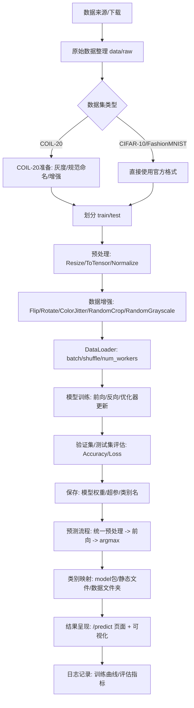
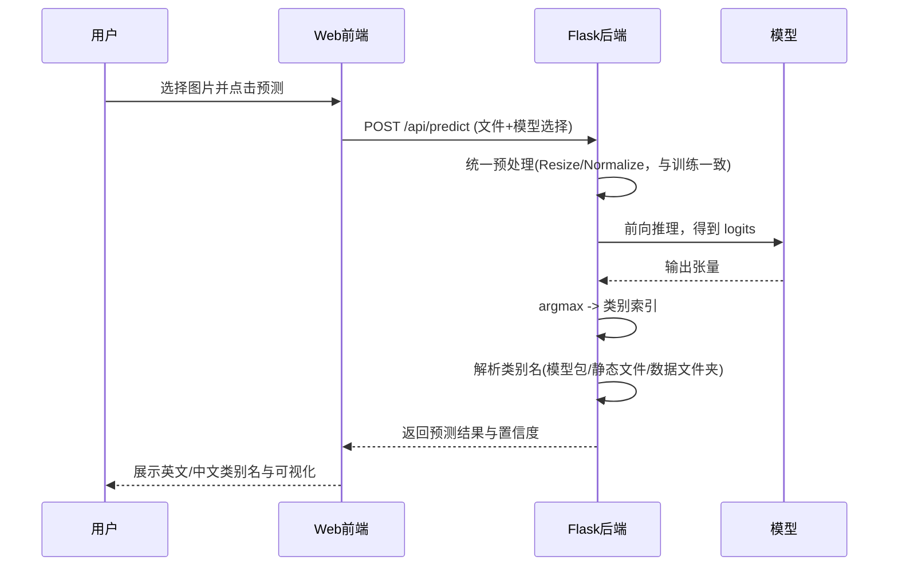

# 深度学习项目答辩说明（含数据处理流程 Mermaid 图）

本文档用于项目答辩，系统梳理数据处理流程、关键参数与作用、核心原理及其相互关系、模型比较维度与参数设置、参数修改的常见影响，以及训练准确率突然下降后又回升的原因分析；同时给出预测流程与常见问题的快速排查指引。

---

## 一、数据处理流程（Mermaid）

> 要点：训练与预测严格共享同一套预处理；类别名来源优先级与模型输出维度保持一致；评估与日志用于复现与对比。

---

## 二、预测流程（Mermaid）

---

## 三、关键参数与作用

- 数据/预处理
  - `image_size`: 统一输入分辨率，便于模型结构匹配与收敛。
  - `normalize(mean, std)`: 对齐训练/预测分布，稳定梯度与输出尺度。
  - `augmentation`: 随机翻转/裁剪/旋转/颜色抖动，提升泛化、降低过拟合。
  - `random_grayscale(p)`: 对 RGB 图像以概率 `p` 随机灰度化，提升灰度域与弱彩色场景的鲁棒性（默认 `p=0.2`）。
  - `灰度转 RGB`: 将灰度数据统一转换为 RGB，避免与 3 通道归一化参数不匹配，并复用同一套预处理。
- 模型结构
  - `architecture`: 如 LeNet、VGG、ResNet；决定特征表达能力与复杂度。
  - `layers/kernels/stride/padding`: 决定感受野、特征分辨率与计算量。
  - `BatchNorm/Dropout`: 归一化与正则化，提升稳定性与泛化能力。
- 训练超参
  - `batch_size`: 影响梯度估计方差与显存占用；与学习率联动。
  - `learning_rate`: 收敛速度与稳定性的核心；需配合调度器。
  - `epochs`: 训练轮数；过长可能过拟合，过短欠拟合。
  - `optimizer`: SGD/Adam 等；动量与自适应策略影响收敛特性。
  - `weight_decay`: L2 正则化，抑制过拟合，过大影响拟合能力。
  - `lr_scheduler`: Step/Cosine/Warmup；在训练阶段不同期望下调节学习率。
- 评估与保存
  - `metrics`: Accuracy、Loss、混淆矩阵等，用于对比与定位问题。
  - `checkpoints`: 权重与配置，支持复现与迁移。
  - `class_names`: 类别名与索引严格对齐，确保结果正确显示。

---

## 四、关键原理与相互关系

- 优化与学习率
  - 学习率过大易震荡甚至发散；过小训练缓慢且易陷局部最优。
  - 批大小增大可适当增大学习率；调度器平衡探索与收敛。
- 正则化与泛化
  - Dropout/Weight Decay/数据增强均可抑制过拟合，但过强会损伤拟合能力。
  - 最佳正则化强度依赖模型复杂度与数据量。
- 归一化与批统计
  - BatchNorm 稳定分布与梯度，训练时统计与推理时统计不同；必须在推理时 `eval()`。
- 数据分布与类别映射
  - 训练与预测的预处理一致性决定输出可信度。
  - 类别名来源与模型输出维度必须一一对应，否则出现“全部预测为某一类”。

---

## 五、模型比较维度与参数设置

- 结构维度：LeNet/VGG/ResNet 的层数、残差块、参数量与计算量。
- 正则化维度：Dropout 比例、Weight Decay 强度、数据增强强度。
- 优化维度：SGD+Momentum vs Adam；不同 `learning_rate` 与 `lr_scheduler`。
- 训练配置：`batch_size`、`epochs`、`image_size` 与归一化方案。
- 数据维度：训练/验证划分比例、类别平衡、是否使用扩增集（如 COIL-20）。

> 对比结论示例：小模型在弱增强与较高学习率下收敛更快但易过拟合；ResNet 在加权衰减与余弦退火下泛化更佳；过大 `batch_size` 在资源受限时不一定提升效果。

---

## 六、参数修改的常见影响

- 学习率上调：初期更快，震荡风险上升；需配合 Warmup 或退火。
- 学习率下调：更稳但更慢；常用于后期精细收敛。
- 增强强度增加：提升鲁棒性，但可能损伤对干净样本的拟合能力。
- Dropout/Weight Decay 增大：过拟合降低，欠拟合风险提升。
- batch_size 增大：训练更快但泛化可能下降；需调整学习率。
- 归一化方案修改：若训练/预测不一致，准确率显著下滑。
 - 灰度增强概率上调：在颜色分布敏感任务上可能略降，但可显著提升面对灰度图、弱光环境与低彩色数据的鲁棒性；建议 `p ∈ [0.1, 0.3]` 结合数据分布调节。

---

## 七、训练准确率突然下降又回升的原因

- 学习率调度点触发（如 Step/Cosine 切换），短时扰动后更稳。
- 随机增强/数据顺序导致小批次统计变化；总体趋势仍改善。
- BatchNorm 的批统计在不同批次出现波动，继续训练后稳定汇聚。
- 正则化项/梯度裁剪作用在特定区间产生抑制效应；后续恢复。
- 验证集采样或度量计算的随机性导致曲线抖动。

---

## 八、常见问题与快速排查

- 现象：所有图片都被预测为“ship”或同一类。
  - 排查：
    - 确认后端推理为 `model.eval()`，关闭 Dropout/BatchNorm 训练态。
    - 统一训练/预测预处理（`Resize/Normalize` 一致）。
    - 核对 `class_names` 与模型输出维度一致；优先使用模型包 `class_names.json`；若缺失，使用 `static/class_names.json`，必要时截断/填充并更新。
    - 检查权重是否正确加载到对应结构；维度不匹配时需重训练或重构头部层。
- 现象：训练指标好，预测很差。
  - 排查：
    - 训练评估是否使用独立测试集而非训练集。
    - 预测时是否做了与训练不同的增强或归一化。
    - 类别索引顺序是否与前端显示一致；避免索引-名称错位。

---

## 九、复现实验与演示步骤

1. 数据准备：在 `data/` 放置官方数据或运行 COIL-20 准备脚本（页面 `Prepare Data`）。
2. 参数配置：在配置页或 `static/model_params.json` 调整 `image_size/batch_size/lr/epochs/optimizer/scheduler` 等。
3. 训练与评估：进入 `Train` 页面启动训练，查看 `training_results.png` 与 `train_results.json`。
4. 预测演示：进入 `Predict` 页面上传样例或使用 `/api/get_sample_image` 提供的类内示例。
5. 类别映射核对：确保 `class_names.json` 来源与模型输出维度一致；必要时更新静态文件以前后端一致。
6. 对比分析：在 `Compare` 页面或文档中对比不同结构/超参设置的指标与曲线。

---

## 十、附录：术语速查

- `Normalize`: 将像素值按通道做线性变换到近似标准分布。
- `Data Augmentation`: 通过随机变换扩展训练分布，提高鲁棒性。
- `BatchNorm`: 用批内统计归一化中间特征，稳定训练。
- `Dropout`: 随机丢弃神经元，降低 co-adaptation，防过拟合。
- `Weight Decay`: 以 L2 惩罚约束权重大小，提升泛化。
- `Scheduler`: 动态调整学习率，兼顾探索与收敛。

---

如需将该文档集成到页面展示，可将 Mermaid 渲染器引入到 `templates` 页面，或在首页添加跳转链接指向本文件内容。